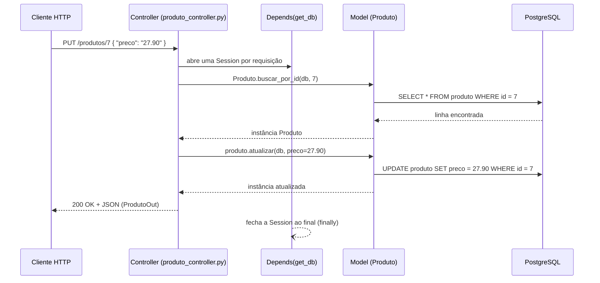

# Arquitetura do Backend — EntregaFood

> Público-alvo deste documento: alguém que acabou de entrar no projeto e nunca
> viu este código. Se depois de ler isso alguma parte do backend ainda parecer
> mágica, é um bug de documentação — abra uma issue ou corrija direto aqui.

## 1. Visão geral

O backend é uma **API REST** feita em **Python 3.12 + FastAPI**, que serve os
dados da plataforma de delivery EntregaFood para dois consumidores:

- o front-end web (`Sistema-de-Delivery-Front`, React + Vite), em um repositório separado;
- qualquer cliente HTTP (Postman, curl, Swagger) — ver [`postman/EntregaFood.postman_collection.json`](../postman/EntregaFood.postman_collection.json).

Os dados são persistidos em **PostgreSQL 16**. Não existe cache, fila de
mensagens ou outro serviço intermediário — é uma API síncrona clássica:
requisição HTTP entra, o banco é consultado/alterado, uma resposta JSON sai.

```
┌─────────────┐        HTTP/JSON        ┌──────────────────┐       SQL       ┌──────────────┐
│  Front-end   │ ───────────────────────▶│   FastAPI (app/)  │ ───────────────▶│  PostgreSQL   │
│  (React)     │◀─────────────────────── │                    │◀─────────────── │  (16)         │
└─────────────┘                          └──────────────────┘                 └──────────────┘
```

## 2. Padrão MVC

O código segue **MVC** (Model-View-Controller), adaptado ao vocabulário do
FastAPI/SQLAlchemy:

| Camada MVC | Pasta | Responsabilidade | Tecnologia |
|---|---|---|---|
| **Model** | `app/models/` | Mapeia tabelas do banco e concentra **regras de negócio** (unicidade de e-mail, CNPJ, etc.) e as operações de persistência (create/read/update/delete). | SQLAlchemy 2.0 (ORM) |
| **View** | `app/schemas/` | Define o **formato exato do JSON** que entra e sai da API — e, mais importante, o que **não** pode sair (ex.: senha nunca aparece numa resposta). | Pydantic 2 |
| **Controller** | `app/controllers/` | Recebe a requisição HTTP, aplica autorização, chama o Model, devolve a resposta no formato do Schema. **Não fala com o banco diretamente.** | FastAPI `APIRouter` |

**A regra que mantém isso honesto:** se aparecer `status_code` dentro de
`models/`, a regra de negócio vazou pro lugar errado — ela pertence ao
Controller. Se aparecer `db.commit()` dentro de `controllers/`, a
persistência vazou — ela pertence ao Model. Ao revisar um PR, é essa a
primeira coisa a checar.

### Ciclo de vida de uma requisição

Exemplo: `PUT /produtos/7` (alterar um produto).



A `Session` do SQLAlchemy é aberta e fechada **por requisição** — é o que
`app/core/database.py::get_db()` faz, injetado em todo controller via
`Depends(get_db)`. Nenhuma sessão é compartilhada entre requisições.

## 3. Estrutura de pastas

```
app/
├── main.py                     Ponto de entrada: cria o FastAPI(), registra
│                                CORS e todos os routers (app.include_router).
│
├── core/                       Infraestrutura compartilhada, sem regra de negócio de domínio.
│   ├── config.py               Lê o .env (Settings, via pydantic-settings). Um único
│   │                           get_settings() com @lru_cache — lido uma vez, reusado sempre.
│   ├── database.py             Engine, SessionLocal e a dependência get_db().
│   ├── security.py             Hash de senha (bcrypt), geração/validação de JWT,
│   │                           e as dependências obter_usuario_logado / exigir_admin
│   │                           que protegem rotas.
│   └── geocoding.py            Placeholder (arquivo vazio) — reservado para uma futura
│                                integração de geocodificação no backend. Hoje quem faz
│                                geocoding é o front (ViaCEP + Nominatim, ver docs do front).
│
├── models/                     Um arquivo por tabela/entidade central.
│   ├── usuario.py               tabela usuario
│   ├── local.py                 tabela local (endereço)
│   ├── restaurante.py           tabela restaurante
│   ├── produto.py                tabela produto
│   ├── codigo_otp.py            tabela codigo_otp (OTP de login/cadastro por telefone)
│   └── sacola.py                 tabelas sacola + item_sacola (carrinho)
│
├── schemas/                    Um arquivo por domínio, mesmo agrupamento dos models.
│   ├── usuario.py, local.py, restaurante.py, produto.py, sacola.py
│   └── consulta.py             Schemas de SAÍDA específicos da visão do cliente
│                                (diferentes dos schemas de administração — ver §5).
│
└── controllers/                Um router por domínio, registrado em main.py.
    ├── usuario_controller.py    prefix="/usuarios"
    ├── auth_controller.py       prefix="/auth"
    ├── local_controller.py      prefix="/locais"
    ├── restaurante_controller.py prefix="/restaurantes"
    ├── produto_controller.py    prefix="/produtos"
    ├── consulta_controller.py   prefix="/consultas"
    └── sacola_controller.py     prefix="/cesta"
```

Fora de `app/`:

```
sql/            Scripts de criação/migração do schema (rodados em ordem numérica
                pelo Postgres na primeira subida — ver docs/BANCO_DE_DADOS.md).
testes/         Scripts standalone (não pytest) que batem na API via
                fastapi.testclient.TestClient e conferem o efeito direto no
                PostgreSQL com SELECT — ver §7.
postman/        Coleção Postman com todos os endpoints (ver README.md).
```

## 4. Autenticação e autorização

Há **quatro caminhos de login**, todos convergindo para o mesmo JWT:

| Caminho | Endpoint(s) | Observação |
|---|---|---|
| E-mail + senha | `POST /auth/login` | Padrão, sempre disponível. |
| Telefone + senha | `POST /auth/login` (mesmo endpoint, corpo com `telefone` em vez de `email`) | `LoginRequest` valida que só um dos dois foi enviado. |
| Telefone + código OTP | `POST /auth/telefone/solicitar-codigo` → `POST /auth/telefone/verificar-codigo` | Código de 6 dígitos, expira em 5 min, 5 tentativas, persistido na tabela `codigo_otp`. |
| Google / Facebook (OAuth2) | `GET /auth/google` → callback → `GET /auth/facebook` → callback | Cria a conta automaticamente no primeiro login (`oauth_provider` marcado). Funciona, mas só para e-mails cadastrados como "tester" nos apps OAuth enquanto eles estiverem em modo de teste — ver README, seção "Limitações conhecidas". |

Qualquer um desses caminhos termina chamando `criar_token_acesso(usuario)`
(`app/core/security.py`), que gera um **JWT HS256** com `sub` (id do usuário),
`email`, `tipo` e expiração (`JWT_EXPIRE_MINUTES`, padrão 60 min).

**Como uma rota fica protegida:** o controller declara um parâmetro
`usuario_logado: Usuario = Depends(obter_usuario_logado)`. Essa dependência:

1. Lê o header `Authorization: Bearer <token>`;
2. Decodifica e valida o JWT (assinatura + expiração);
3. Busca o usuário pelo `sub` no banco;
4. Devolve a instância de `Usuario` — ou lança `401` se qualquer passo falhar.

Para rotas **admin-only** existe `Depends(exigir_admin)`, que empilha a
checagem de `tipo == "admin"` em cima de `obter_usuario_logado`. Hoje só
`usuario_controller.py` aplica essa checagem de dono-ou-admin (ver
`_exigir_dono_ou_admin` nesse arquivo) — `restaurante_controller.py` e
`produto_controller.py` **não** exigem autenticação em nenhuma rota (nem
`PUT`/`DELETE`). Isso é uma lacuna de segurança conhecida, documentada no
README principal (seção "Limitações conhecidas"), não um acidente de leitura.

Senhas nunca são armazenadas em texto puro: `gerar_hash_senha()` usa
**bcrypt** via `passlib`. O `UsuarioOut` (schema de saída) simplesmente não
declara o campo `senha_hash` — a garantia de "a senha nunca vaza na resposta"
é estrutural, não uma checagem manual em cada endpoint.

## 5. Duas visões diferentes do mesmo dado: administração vs. cliente

Um ponto que confunde quem chega agora: **existem dois conjuntos de rotas
para restaurantes e produtos**, com propósitos diferentes.

| | `/restaurantes`, `/produtos` (administração) | `/consultas/*` (cliente) |
|---|---|---|
| Schemas | `RestauranteOut`, `ProdutoOut` (`app/schemas/restaurante.py`, `produto.py`) | `RestauranteConsultaOut`, `ItemCardapioOut`, `CardapioOut` (`app/schemas/consulta.py`) |
| Quem usa | Painel administrativo / dono do restaurante | App do cliente final |
| Filtro de visibilidade | Nenhum — devolve tudo, inclusive `pendente`/`recusado` e produto indisponível | Só `status_aprovacao = 'aprovado'` e `disponivel = true` |
| Expõe CNPJ? | Sim | Não |
| Expõe endereço? | Não (só `local_id`) | Sim, embutido (`local` com endereço/lat/long) |

Ou seja: **não são endpoints redundantes**. `consulta_controller.py` é uma
camada de leitura pensada para quem vai *pedir comida*, enquanto
`restaurante_controller.py`/`produto_controller.py` são o CRUD de quem
*gerencia* o cardápio.

## 6. Configuração (`app/core/config.py`)

Toda configuração vem de variáveis de ambiente, lidas de um arquivo `.env`
(nunca commitado — veja `.env.example`) via `pydantic-settings`. As
principais:

| Variável | Para quê |
|---|---|
| `DATABASE_URL` | String de conexão do PostgreSQL (formato `postgresql+psycopg://...`) |
| `JWT_SECRET`, `JWT_ALGORITHM`, `JWT_EXPIRE_MINUTES` | Assinatura e expiração do token |
| `CORS_ORIGINS` | Lista de origens permitidas (separadas por vírgula) — precisa incluir a URL do front |
| `GOOGLE_CLIENT_ID`/`SECRET`/`REDIRECT_URI` | OAuth Google |
| `FACEBOOK_APP_ID`/`SECRET`/`REDIRECT_URI` | OAuth Facebook |
| `FRONTEND_URL` | Para onde redirecionar depois de um login OAuth bem-sucedido |

`get_settings()` usa `@lru_cache`: o `.env` é lido uma única vez por processo
e reaproveitado — não é preciso reinstanciar `Settings()` em nenhum lugar.

## 7. Testes

Os testes **não são pytest** — são scripts standalone (`testes/teste_*.py`)
que:

1. Sobem um `fastapi.testclient.TestClient(app)` — chama a API em processo,
   sem precisar de um servidor rodando;
2. Batem nos endpoints de verdade (POST/GET/PUT/DELETE);
3. Conferem o efeito **direto no PostgreSQL real** com `SELECT` via SQLAlchemy
   — não é um banco mockado nem sqlite em memória, é o mesmo banco que a
   aplicação usa (`docker compose up -d`).

Três baterias, uma por entrega:

| Arquivo | Cobre |
|---|---|
| `teste_crud_sprint1.py` | CRUD de Usuário, login, autorização dono-ou-admin (30 verificações) |
| `teste_crud_produto.py` | CRUD de Produto (com a cadeia Local → Restaurante → Produto) |
| `teste_consulta_cardapio.py` | Regras de visibilidade de `/consultas/*` |

Como rodar (veja o README para os pré-requisitos completos): com o banco no
ar (`docker compose up -d` ou `docker compose -f docker-compose.full.yml up -d`),
`python testes/teste_crud_sprint1.py` a partir da raiz do repositório. Se a
API já está rodando em container (`entregafood-backend`), dá pra rodar
direto lá dentro sem precisar de venv local:
`docker exec entregafood-backend python testes/teste_crud_sprint1.py`.

## 8. Deploy / ambientes

- **Local**: `docker-compose.yml` sobe só o banco; a API roda via
  `uvicorn app.main:app --reload` na máquina do desenvolvedor.
- **Local, tudo em container**: `docker-compose.full.yml` sobe banco + API +
  front-end juntos (usado para demonstração/onboarding rápido).
- **Produção (Render)**: o `FACEBOOK_REDIRECT_URI` padrão em
  `config.py` aponta para `entregafood-back-dev.onrender.com`, indicando que
  o backend também é publicado no Render — não há um `Dockerfile` de
  produção separado, é a mesma imagem.

## 9. Débitos técnicos conhecidos

Documentados aqui para não serem redescobertos do zero a cada sprint (ver
também o README, seção "Limitações conhecidas"):

- `restaurante_controller.py` e `produto_controller.py` não exigem
  autenticação em nenhuma rota — qualquer requisição altera qualquer
  registro pelo `id`.
- `app/core/geocoding.py` e `testes/teste_geocoding_local.py` existem como
  arquivos vazios (0 bytes) — reservados para uma integração futura, ainda
  sem código.
- O login social (Google/Facebook) só autentica e-mails cadastrados como
  "tester" nos respectivos apps OAuth, que ainda estão em modo de teste.
- As tabelas `pedido`, `item_pedido`, `pagamento`, `entrega` e `avaliacao`
  existem no schema SQL (`sql/01_create_tables.sql`) mas não têm
  model/controller/endpoint ainda — só `sacola`/`item_sacola` (a cesta) foi
  implementada até agora.
