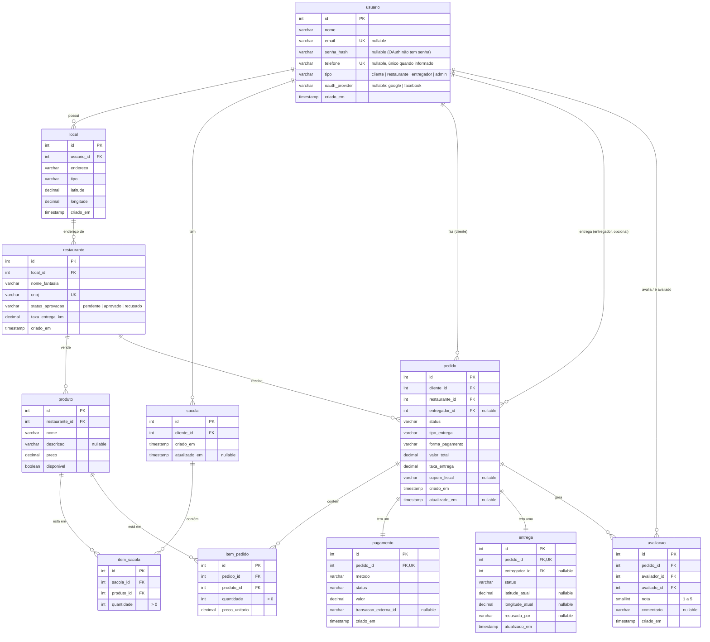

# Banco de Dados — EntregaFood

PostgreSQL 16, banco relacional (schema definido explicitamente, sem ORM
autogerando migrations — os arquivos em `sql/` são a fonte da verdade).

## Como o schema é criado

Os scripts em `sql/` rodam **automaticamente, em ordem alfabética/numérica**,
na primeira subida do container do banco (`docker-compose.yml` monta
`./sql` em `/docker-entrypoint-initdb.d`, um mecanismo padrão da imagem
oficial `postgres`). Isso só acontece quando o volume de dados está vazio —
se você já tem um `entregafood-db` com dados, rodar um script novo em `sql/`
não o aplica automaticamente; é preciso rodá-lo manualmente com `psql` ou
recriar o volume.

| Ordem | Arquivo | O que faz |
|---|---|---|
| 1 | `01_create_tables.sql` | Cria as 11 tabelas do domínio completo (a maioria ainda sem model/controller — ver §3). |
| 2 | `02_sprint2_telefone.sql` | Permite `usuario.email` nulo, adiciona índice único parcial em `telefone`, e uma constraint garantindo que todo usuário tem e-mail **ou** telefone. |
| 3 | `03_create_codigo_otp.sql` | Cria a tabela `codigo_otp` (login/cadastro por telefone). |
| 4 | `04_seed_cardapio.sql` | **Dados de exemplo**, não schema — popula usuário/local/restaurante/produto pra ter o que consultar em `/consultas/*`. Idempotente (pode rodar de novo sem duplicar). |

## Diagrama entidade-relacionamento

Só as tabelas com FK entre si estão desenhadas; `codigo_otp` é isolada (chave
primária composta `telefone` + `finalidade`, sem FK).



## Tabela por tabela

### `usuario`
Cadastro único para os quatro perfis da plataforma. `tipo` é restrito por
`CHECK` a `cliente | restaurante | entregador | admin`. `email` e `telefone`
são ambos opcionais individualmente, mas uma constraint garante que **pelo
menos um** esteja preenchido (`ck_usuario_email_ou_telefone`, adicionada em
`02_sprint2_telefone.sql`). `senha_hash` é nulo para contas criadas via OAuth
(Google/Facebook não têm senha local). **Model:** `app/models/usuario.py`.

### `local`
Endereço vinculado a um usuário (`usuario_id`). É pré-requisito para
`restaurante` — todo restaurante precisa de um `local_id`. `tipo` é texto
livre (ex.: "casa", "restaurante") sem `CHECK` no banco. **Model:**
`app/models/local.py`.

### `restaurante`
`cnpj` é único. `status_aprovacao` controla a visibilidade nas rotas
`/consultas/*` (só `'aprovado'` aparece pro cliente) — ver
`docs/ARQUITETURA.md`, §5. **Model:** `app/models/restaurante.py`.

### `produto`
Vinculado a um `restaurante_id`. `disponivel` controla se aparece no
cardápio do cliente. **Model:** `app/models/produto.py`.

### `sacola` / `item_sacola`
Carrinho de compras do cliente. Um cliente pode ter mais de uma `sacola` ao
longo do tempo (histórico); `Sacola.buscar_por_cliente` busca a mais recente
(`ORDER BY id DESC`). **Model:** `app/models/sacola.py`. **Endpoint:**
`GET /cesta` (só leitura hoje — não existe endpoint pra adicionar/remover
item ainda).

### `codigo_otp`
Chave primária composta (`telefone`, `finalidade`) — um único código ativo
por telefone e por finalidade (`'login'` ou `'cadastro'`) por vez; gerar um
novo código sobrescreve o anterior. `tentativas` limita a 5 tentativas antes
de invalidar o código. Criada em `03_create_codigo_otp.sql`. **Model:**
`app/models/codigo_otp.py`.

### `pedido`, `item_pedido`, `pagamento`, `entrega`, `avaliacao`
Existem no schema (`01_create_tables.sql`) com todas as colunas e FKs já
desenhadas, **mas ainda não têm model, controller nem endpoint** — são o
próximo passo natural do domínio (fechar um pedido a partir da sacola, pagar,
acompanhar entrega, avaliar). Se for implementar algum desses, o schema já
está pronto; falta só a camada de aplicação.

## Índices

```sql
CREATE INDEX idx_produto_restaurante ON produto(restaurante_id);
CREATE INDEX idx_pedido_cliente      ON pedido(cliente_id);
CREATE INDEX idx_pedido_restaurante  ON pedido(restaurante_id);
CREATE INDEX idx_pedido_entregador   ON pedido(entregador_id);
CREATE INDEX idx_local_usuario       ON local(usuario_id);
```

Cobrem os padrões de consulta mais comuns (listar produtos de um
restaurante, listar pedidos de um cliente/restaurante/entregador, listar
locais de um usuário).

## Dados de exemplo (seed)

`sql/04_seed_cardapio.sql` cria, de forma idempotente (identifica os
registros pelo CNPJ/e-mail do seed, então rodar duas vezes não duplica):

- 1 usuário dono (`seed-cardapio@entregafood.com`, tipo `restaurante`)
- 3 locais/endereços em São Paulo
- 3 restaurantes: **Burger da Paulista** e **Sushi Aurora** (`aprovado`),
  **Cantina Pinheiros** (`pendente`, de propósito — para provar que a
  consulta do cliente não devolve restaurante não aprovado)
- 7 produtos, um deles (**Milk-shake**) marcado `disponivel = false` de
  propósito, pela mesma razão

Rodar: `psql -h localhost -U postgres -d entregafood -f sql/04_seed_cardapio.sql`
(ou dentro do container: veja o README).
